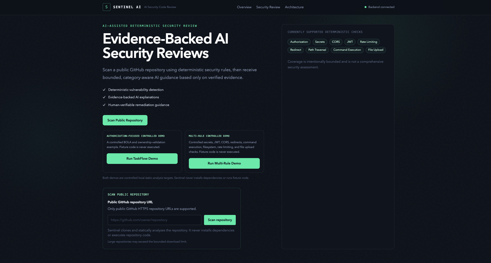
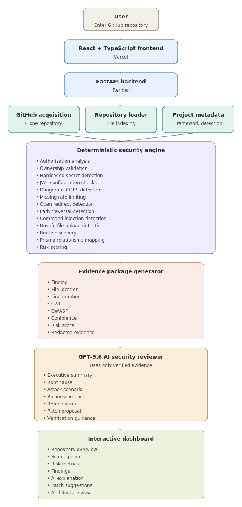
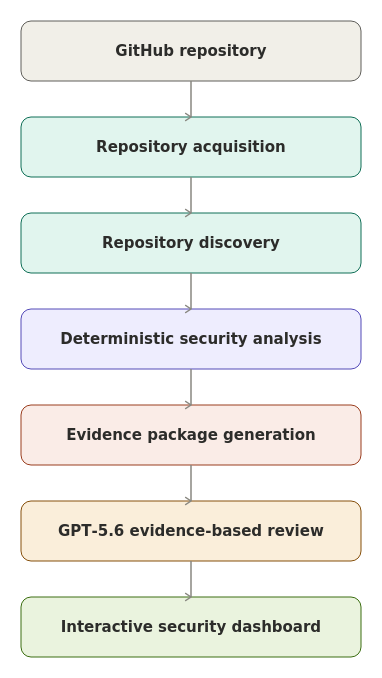
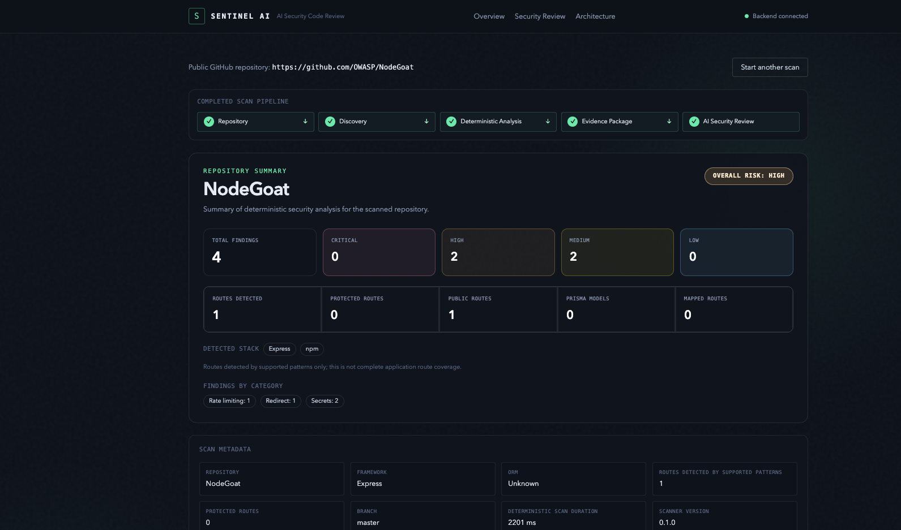
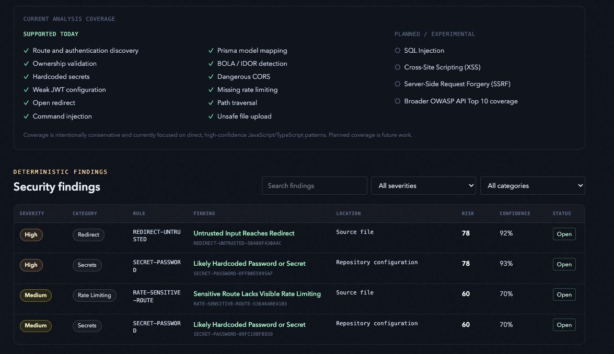
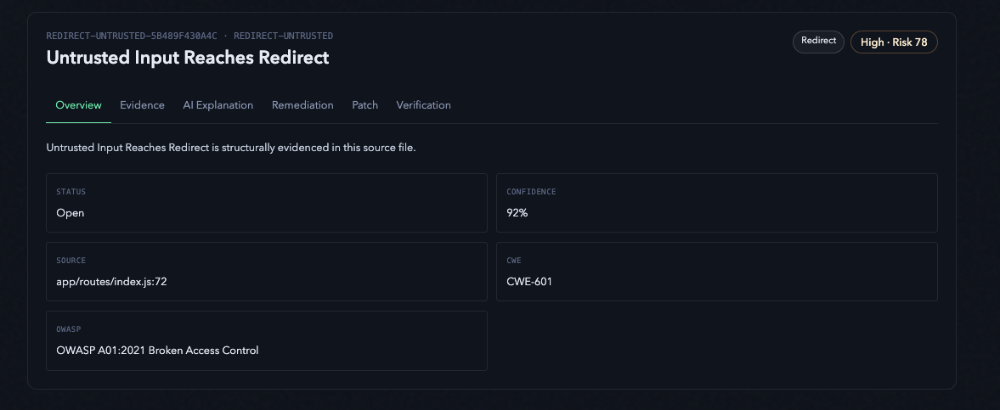
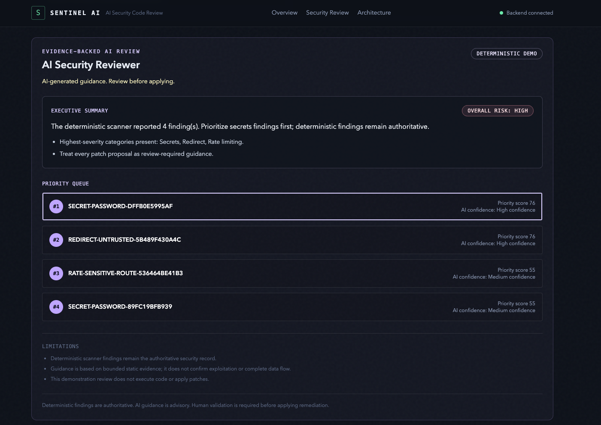
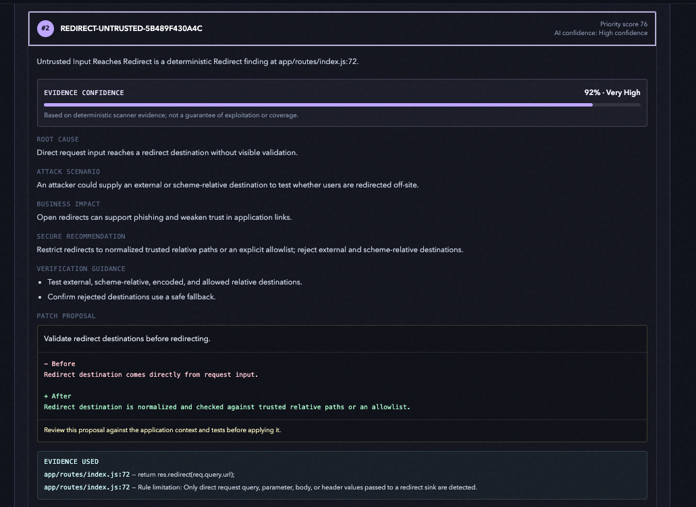
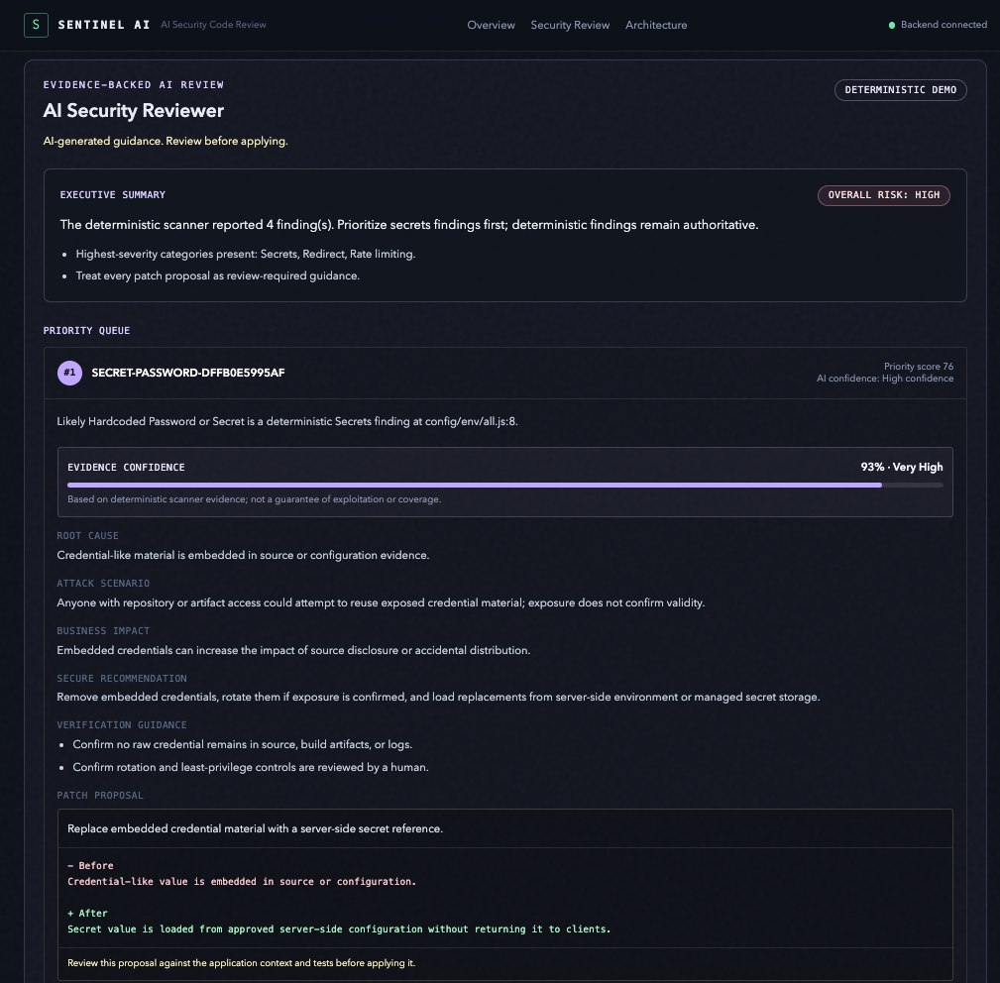

# Sentinel AI

> **Evidence-Backed AI Security Review Platform**<br>
> *Find it. Prove it. Fix it. Verify it.*

<p align="center">
  
  
  
  
  
</p>

<p align="center">

</p>

---

## Overview

Sentinel AI is a security review platform for AI-generated web applications. It combines deterministic static analysis with bounded evidence and optional GPT-5.6 explanation enrichment to help developers understand verified security findings and review remediation guidance.

Deterministic findings are always the security record. AI can explain existing evidence, summarize risk, and propose review-required guidance, but it never creates, changes, or suppresses deterministic findings.

---

## Key Features

- 🔗 **Safe public-repository acquisition** — validates public HTTPS GitHub URLs, uses a shallow clone in an application-owned temporary workspace, and cleans up after scanning.
- 🔎 **Deterministic security scanner** — discovers supported routes, authentication signals, Prisma models, ownership controls, and conservative security-rule evidence.
- 📦 **Bounded evidence package** — redacts sensitive values and constrains the facts exposed to reviewer components.
- 🤖 **Optional GPT-5.6 explanations** — structured, server-side enrichment for existing deterministic findings when configured.
- 🧑‍⚖️ **Human-verifiable remediation** — guidance and patch proposals are advisory and require human review.
- 🧭 **Architecture visibility** — exposes the scanner, evidence, reviewer, and trust-boundary workflow.
- 📊 **Explainable risk scoring** — stable IDs, severity, confidence, risk components, CWE, and OWASP references travel with each finding.
- 🛡️ **Static analysis only** — Sentinel never installs dependencies or executes scanned repository code.
- 🌐 **Public GitHub support** — scans validated public GitHub repositories alongside controlled bundled demos.

---

## Architecture

<p align="center">
  
</p>

| Component | Responsibility |
| --- | --- |
| **Repository acquisition** | Validates public GitHub URLs, performs a non-interactive shallow clone, applies repository limits, and owns temporary cleanup. |
| **Discovery engine** | Identifies supported frameworks, routes, authentication, Prisma models, and ownership candidates. |
| **Deterministic scanner** | Emits conservative findings with stable IDs, severity, confidence, risk components, and redacted evidence. |
| **Evidence package** | Selects bounded, sanitized, relevant scan evidence; it excludes environment files, credentials, Git metadata, lockfiles, binaries, and unsupported content. |
| **AI layer** | Optionally produces structured explanations for deterministic evidence; it has no authority to alter findings. |
| **Dashboard** | Presents scan metadata, findings, evidence, review guidance, and review-required remediation. |

Only bounded evidence is eligible for AI enrichment. Repository code is never executed, and deterministic output remains authoritative.

---

## Scan Pipeline

<p align="center">
  
</p>

```text
Repository
    ↓
Discovery
    ↓
Deterministic Analysis
    ↓
Evidence Package
    ↓
GPT-5.6 Review (optional)
    ↓
Dashboard
```

The interface shows stage-based progress rather than fabricated completion percentages. A failed or unavailable AI request does not invalidate the completed deterministic scan.

---

## Project Structure

```text
sentinel-ai/
├── apps/
│   ├── api/                    FastAPI service, scanner, GitHub workflow, and reviewer
│   └── web/                    Next.js dashboard and frontend tests
├── demo/
│   ├── vulnerable-taskflow/    Controlled Express/Prisma BOLA demonstration target
│   └── vulnerable-multirule/   Controlled deterministic-rule fixture
├── docs/                       Development notes and scanner architecture
├── rules/                      Deterministic rule assets
├── scripts/                    Safe development helpers
├── Screenshots/                Product and architecture screenshots
├── .env.example                Local server-side configuration template
├── AGENTS.md                   Contributor and safety guidance
└── README.md                   Project documentation
```

- `apps/api` contains the public API, scanning orchestration, repository acquisition, deterministic rules, and reviewer models.
- `apps/web` contains the scan launcher, results dashboard, and accessibility-focused frontend.
- `demo` contains controlled static-analysis targets. They are never executed by Sentinel.

---

## Core Components

| Component | What it does |
| --- | --- |
| GitHub Acquisition | Accepts only validated public HTTPS GitHub repository URLs, clones shallowly, disables credential prompts and submodules, enforces limits, and cleans up. |
| Discovery Engine | Detects supported routes, authentication, Prisma models, route-to-model mappings, and ownership fields. |
| Deterministic Scanner | Produces conservative security findings from static source evidence. |
| Evidence Package | Builds bounded, redacted reviewer input without absolute paths or sensitive repository artifacts. |
| GPT Reviewer | Provides optional structured explanation enrichment for existing evidence; the reviewer panel defaults to a deterministic demo response when no live reviewer is configured. |
| Dashboard | Renders scan metadata, findings, detail views, risk context, and review guidance without treating AI as authoritative. |

---

## Detection Coverage

### Supported Today

| Area | Current deterministic coverage |
| --- | --- |
| Authorization | Route discovery, authentication discovery, Prisma mapping, ownership analysis, and BOLA/IDOR candidates |
| Secrets | Conservative hardcoded private-key, provider-token, password, and secret assignment detection with deterministic false-positive controls |
| CORS | Wildcard credentials and direct reflected-origin patterns |
| JWT | `none` algorithm, disabled verification, hardcoded signing secrets, and unsafe authentication decode patterns |
| Rate Limiting | Sensitive Express route patterns lacking visible rate limiting |
| Redirect | Direct request input reaching redirect sinks |
| Path Traversal | Direct request-controlled values reaching supported filesystem sinks |
| Command Injection | Direct request input or interpolation reaching `exec`/`execSync` sinks |
| Unsafe File Upload | Multer-style handlers without visible type and size controls |

### Planned

| Area | Status |
| --- | --- |
| SQL Injection | Planned |
| Cross-Site Scripting (XSS) | Planned |
| Server-Side Request Forgery (SSRF) | Planned |
| More OWASP API Top 10 coverage | Planned |

Sentinel’s coverage is intentionally bounded; it is not a comprehensive security assessment or full OWASP scanner.

---

## Screenshots

### Landing Page


### Repository Scan



### Repository Summary



### Security Findings



### AI Review



### AI Explanation



### AI Remediation



### Architecture Diagram


### Pipeline Flow


---

## Tech Stack

| Category | Technologies |
| --- | --- |
| Frontend | Next.js 16, React 19, TypeScript, Tailwind CSS |
| Backend | Python 3.12+, FastAPI, Pydantic, Uvicorn |
| AI | OpenAI SDK, optional GPT-5.6 structured explanation provider, deterministic demo reviewer |
| Security Analysis | Deterministic Python rules, static source indexing, Express and Prisma discovery |
| Testing | pytest, Vitest, Supertest, Ruff, mypy, ESLint, TypeScript |
| Local Development | npm workspaces, Python virtual environment, Docker Compose for the TaskFlow demo |

---

## Getting Started

### Installation

```bash
cp .env.example .env
npm install
python3 -m venv apps/api/.venv
apps/api/.venv/bin/python -m pip install -e 'apps/api[dev]'
```

### Run the Backend

```bash
npm run dev:api
```

The FastAPI service runs at [http://localhost:8000](http://localhost:8000).

### Run the Frontend

```bash
npm run dev:web
```

Open [http://localhost:3000](http://localhost:3000).

### Environment Variables

Use [.env.example](.env.example) as the local template.

| Variable | Purpose |
| --- | --- |
| `API_URL` | Server-side Next.js-to-FastAPI URL |
| `CORS_ORIGINS` | Allowed browser origins for local development |
| `SENTINEL_SCAN_ROOT` | Optional bound for local-path scans |
| `SENTINEL_AI_ENABLED` | Enables optional server-side AI explanation enrichment |
| `OPENAI_API_KEY` | Server-side OpenAI credential; never expose through `NEXT_PUBLIC_` |
| `OPENAI_MODEL` | Optional model override; defaults to the configured GPT-5.6 identifier |

Never commit `.env` files or expose credentials to the browser.

---

## Testing

The backend currently has **214+ passing automated tests**. Run the backend checks from `apps/api`:

```bash
.venv/bin/python -m pytest -q
.venv/bin/python -m ruff check .
.venv/bin/python -m mypy src tests
```

Useful repository-wide commands:

```bash
npm run test
npm run lint
npm run typecheck
npm run build
```

---

## How GPT-5.6 Was Used

When server-side AI enrichment is enabled, Sentinel uses GPT-5.6 through a structured-output provider to explain deterministic evidence. It supports:

- evidence-backed risk explanation
- executive summaries and prioritized review context
- remediation guidance
- review-required patch suggestions
- verification guidance

GPT never invents findings. It only receives bounded deterministic evidence and cannot change finding IDs, severity, confidence, risk scoring, or scanner output. The post-scan reviewer interface currently works in deterministic demo mode by default; its separate live reviewer provider remains a placeholder.

---

## How Codex Was Used

Codex assisted the project through implementation support and iteration, including:

- repository scaffolding and backend/frontend integration
- deterministic rule implementation and false-positive refinement
- automated test generation and maintenance
- refactoring, bug fixes, and type-checking improvements
- dashboard and architecture refinement
- documentation and README improvements

Every Codex-generated change was reviewed before merging. Architecture decisions, security boundaries, and final validation remained under human control.

---

## Limitations

- Static analysis only; Sentinel does not execute repository code.
- Public HTTPS GitHub repositories only; private repositories are not supported.
- Bounded deterministic rule coverage; results are not comprehensive OWASP coverage.
- Repository acquisition and analysis are resource-limited; large repositories may require additional optimization.
- The project is a prototype and should not be treated as a substitute for a full security assessment.
- A server-side OpenAI API key is required for optional GPT-5.6 explanation enrichment.
- The separate live AI reviewer provider is not yet implemented; deterministic demo review remains available.

---

## Future Roadmap

- Incremental and diff-aware scanning
- SARIF export
- GitHub App workflow
- CI/CD integration and pull-request feedback
- VS Code extension
- Additional OWASP API Top 10 coverage
- Additional programming languages and frameworks
- Repository graph analysis

---

## Live Demo

| Resource | Status |
| --- | --- |
| Backend | Not publicly deployed |
| Frontend | Not publicly deployed |
| GitHub | Use this repository’s GitHub page |

For a local demonstration, run the backend and frontend commands above, then choose **Run TaskFlow Demo** or **Run Multi-Rule Demo** from the dashboard.

---

## License

No license has been finalized for this repository. Add an approved license file before distributing or accepting external contributions under a license grant.
